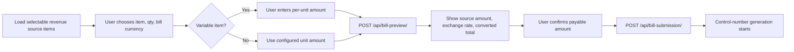

# NIMR Billing API

Base URL: `/api`

## Authentication

- **Bill submission** uses API keys via header: `Authorization: Api-Key <key>`.
- **Bill document downloads** use the same API key authentication and return PDF attachments.
- **Internal endpoints** require an admin user (DRF defaults: session or basic auth).
- **Callback endpoints** are unauthenticated.

## Endpoints

### POST `/api/bill-submission/`
Submits a bill and starts control-number processing. Requests are idempotent within 10-minute buckets.
If the bill currency is `TZS` while the revenue source item is `USD`, the server converts amounts using the latest exchange rate.
Variable revenue source items require an `amount`; fixed revenue source items continue to use their configured amount.

**Request body**

```json
{
  "sys_code": "SYS001",
  "bill_dept": "Finance",
  "description": "Monthly subscription",
  "revenue_source": 123,
  "qty": 3,
  "currency": "TZS",
  "amount": "500.00",
  "customer": {
    "first_name": "John",
    "middle_name": "A.",
    "last_name": "Doe",
    "cell_num": "255700000000",
    "email": "john.doe@example.com"
  }
}
```

`qty` is optional and defaults to `1`. When provided, the server multiplies the selected revenue source item's unit amount by `qty`.

`amount` is required only when the selected revenue source item has `fee_type` of `VARIABLE`, and it is treated as the **per-unit amount**. For fixed items, omit `amount` or provide the exact configured per-unit amount.

Successful responses now include a `pricing` object with the final pricing breakdown used for bill creation.

**Responses**
- `201` Created
- `202` Accepted (duplicate in progress)
- `400` Validation error
- `500` Server error

### POST `/api/bill-preview/`
Returns a pricing preview before bill submission so clients can display the selected unit amount, exchange rate, and total payable to the user.

Only the currently supported USD -> TZS conversion path is previewed when currencies differ. Unsupported currency combinations return a validation error.

**Recommended client flow**



**Pricing semantics**

| Field | Meaning |
| --- | --- |
| `source_unit_amount` | The per-unit amount in the revenue source item's own currency. For variable items, this comes from the submitted `amount`. |
| `source_total_amount` | `source_unit_amount * qty` before any currency conversion. |
| `bill_currency` | The currency the bill will be issued in. |
| `converted_unit_amount` | The per-unit amount after conversion into `bill_currency`. If no conversion is needed, this matches `source_unit_amount`. |
| `converted_total_amount` | The final payable total after quantity and any supported currency conversion are applied. |
| `exchange_rate` | The exchange rate used for the preview. This is `1.00` when no conversion is applied. |
| `exchange_rate_date` | The date of the exchange rate record used for preview. |
| `conversion_applied` | `true` when the preview converted the revenue source currency into the selected bill currency. |

**Request body**

```json
{
  "revenue_source": 123,
  "qty": 3,
  "currency": "TZS",
  "amount": "500.00"
}
```

`amount` is required only for variable revenue source items and is interpreted as a per-unit amount.

The preview endpoint is the best place to show the payable figure to end users. It lets clients render a confirmation state before the bill is created and before control-number processing begins.

**Response body**

```json
{
  "source_currency": "USD",
  "bill_currency": "TZS",
  "qty": 3,
  "source_unit_amount": "10.00",
  "source_total_amount": "30.00",
  "converted_unit_amount": "25000.00",
  "converted_total_amount": "75000.00",
  "exchange_rate": "2500.00",
  "exchange_rate_date": "2026-05-12",
  "conversion_applied": true
}
```

**Responses**

- `200` OK
- `400` Validation error
- `403` Invalid or missing API key

### GET `/api/revenue-source-items/`
Returns selectable variable revenue source items. Use the item `description` for display, submit the selected `id` as `revenue_source`, and call `/api/bill-preview/` before `/api/bill-submission/` when you need to show the payable amount to the user.

**Responses**

- `200` OK

```json
[
  {
    "id": 46,
    "description": "AJSC 2026 Test Item",
    "currency": "TZS",
    "fee_type": "VARIABLE",
    "fixed_amount": "0.00",
    "min_amount": "1.00",
    "max_amount": null,
    "revenue_source": {
      "id": 12,
      "name": "AJSC",
      "gfs_code": "..."
    }
  }
]
```

### GET `/api/billing/bills/{bill_id}/invoice/`
Downloads the invoice PDF for a bill as an attachment. Requires an API key.

The invoice becomes downloadable after the bill has a control number.

**Responses**
- `200` OK (`application/pdf`)
- `404` Bill not found
- `409` Invoice not ready (`reason: missing_control_number`)

### GET `/api/billing/bills/{bill_id}/receipt/`
Downloads the receipt PDF for a bill as an attachment. Requires an API key.

The receipt becomes downloadable after the bill has a recorded payment.

**Responses**
- `200` OK (`application/pdf`)
- `404` Bill not found
- `409` Receipt not ready (`reason: missing_payment`)

### POST `/api/bill-cntrl-num-response-callback/`
Records a control-number response. Duplicate posts are safe.

**Request body**

```json
{
  "req_id": "REQ1",
  "bill_id": "BILL1",
  "cntrl_num": "CNTRL1",
  "bill_amt": "100.00"
}
```

**Responses**
- `200` OK (includes `duplicate: true|false`)
- `400` Missing or invalid fields
- `500` Server error

### POST `/api/bill-cntrl-num-payment-callback/`
Records a payment notification. Duplicate posts are safe by `trx_id`.

**Request body**

```json
{
  "bill_id": "BILL1",
  "psp_code": "PSP01",
  "psp_name": "Provider",
  "trx_id": "TRX123",
  "payref_id": "PAYREF1",
  "bill_amt": "100.00",
  "paid_amt": "100.00",
  "paid_ccy": "TZS",
  "coll_acc_num": "000000000000",
  "trx_date": "2025-01-01T10:00:00Z",
  "pay_channel": "BANK",
  "pay_cell_num": "255700000000"
}
```

**Responses**
- `200` OK (includes `duplicate: true|false`)
- `400` Missing or invalid fields
- `500` Server error

### GET `/api/internal/billing/bills/{bill_id}/deliveries`
Returns email delivery attempts for the bill. Requires an admin user.

**Responses**
- `200` OK
- `404` Bill not found

### POST `/api/internal/billing/bills/{bill_id}/deliveries/resend`
Enqueues a resend of a billing document. Requires an admin user.

**Request body**

```json
{
  "document_type": "INVOICE",
  "recipient_email": "optional@example.com"
}
```

**Responses**
- `202` Accepted
- `400` Invalid document type
- `404` Bill not found

## Schemas

The full OpenAPI schema is available at `docs/openapi.yaml`.
